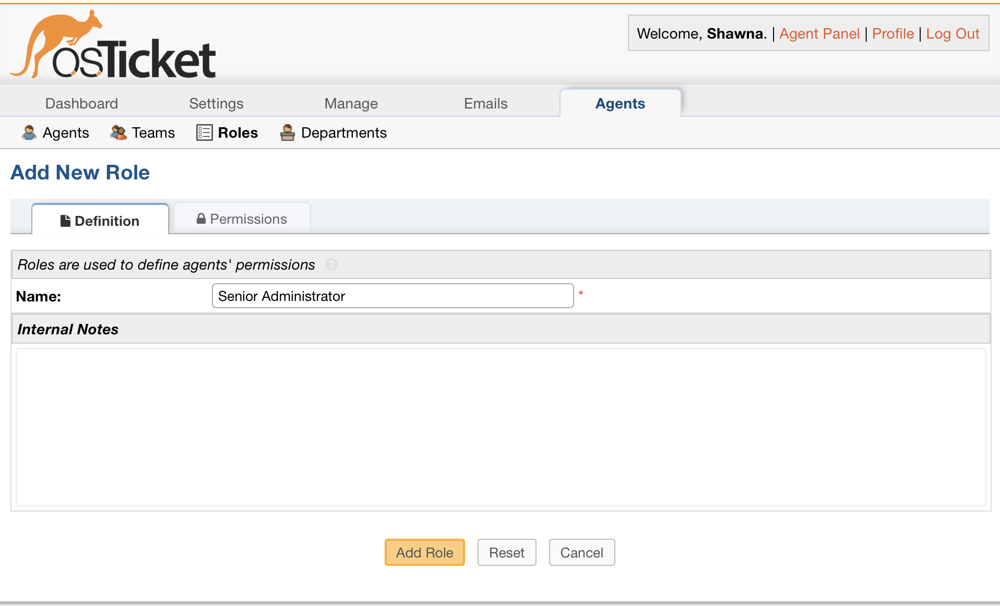
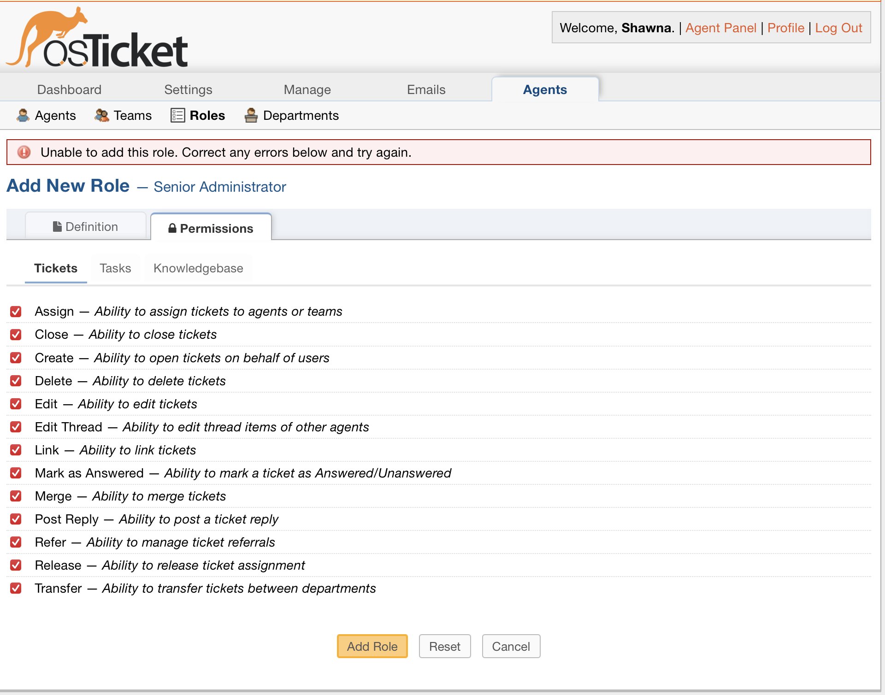
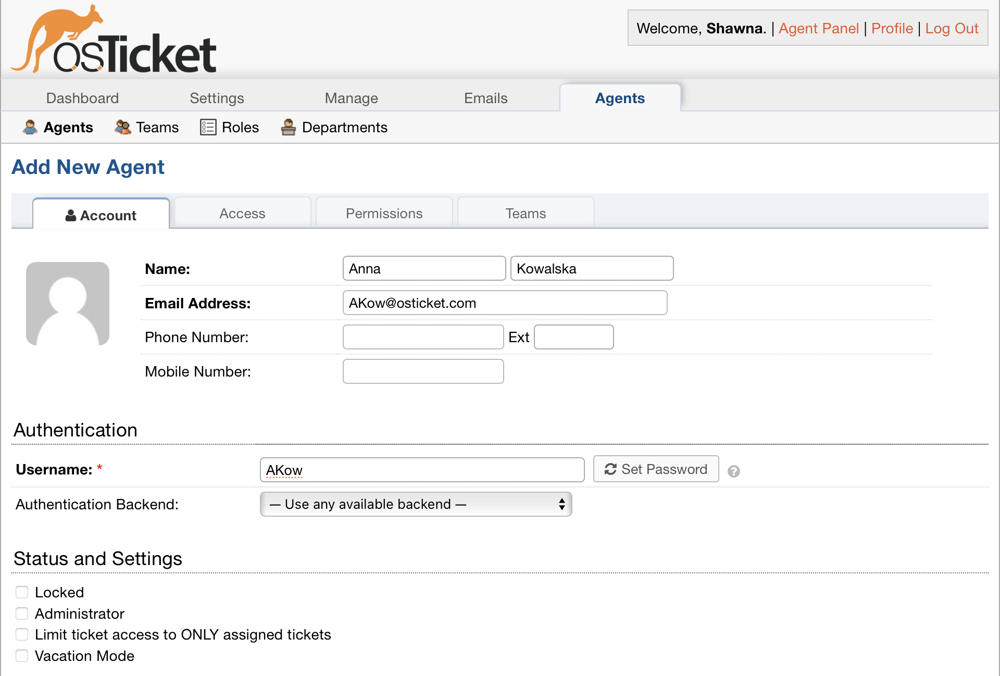
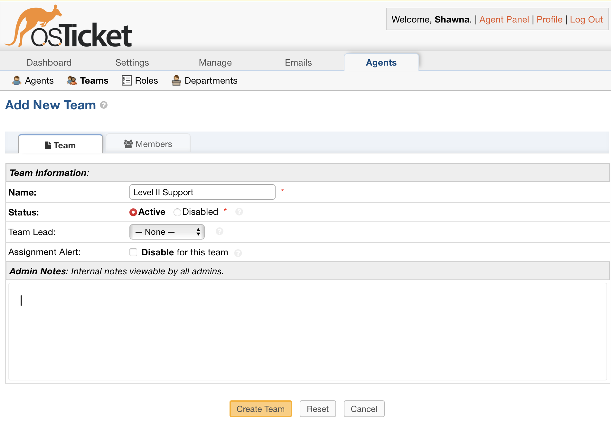
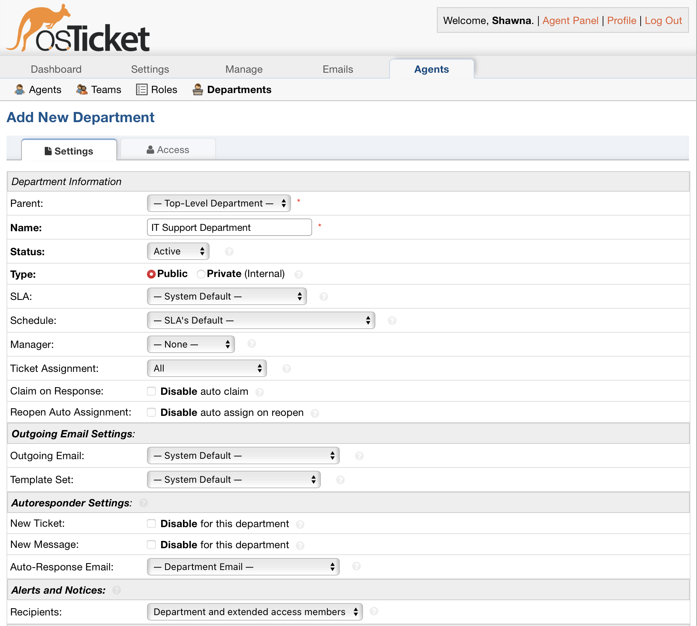
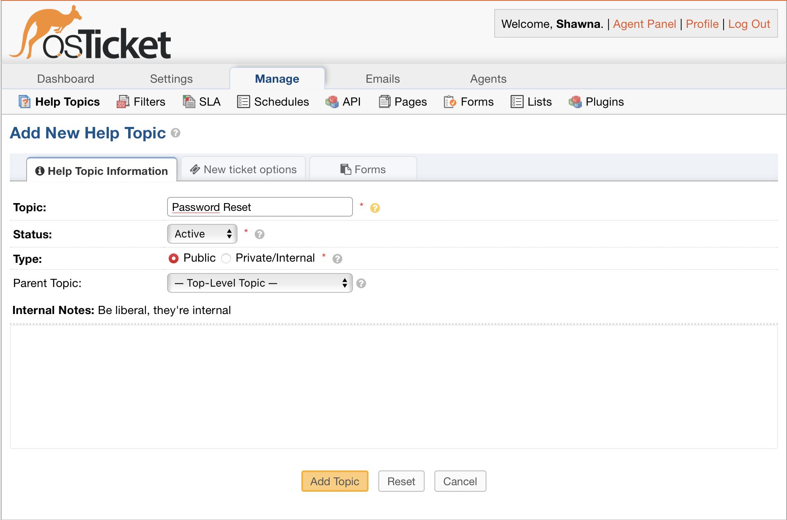
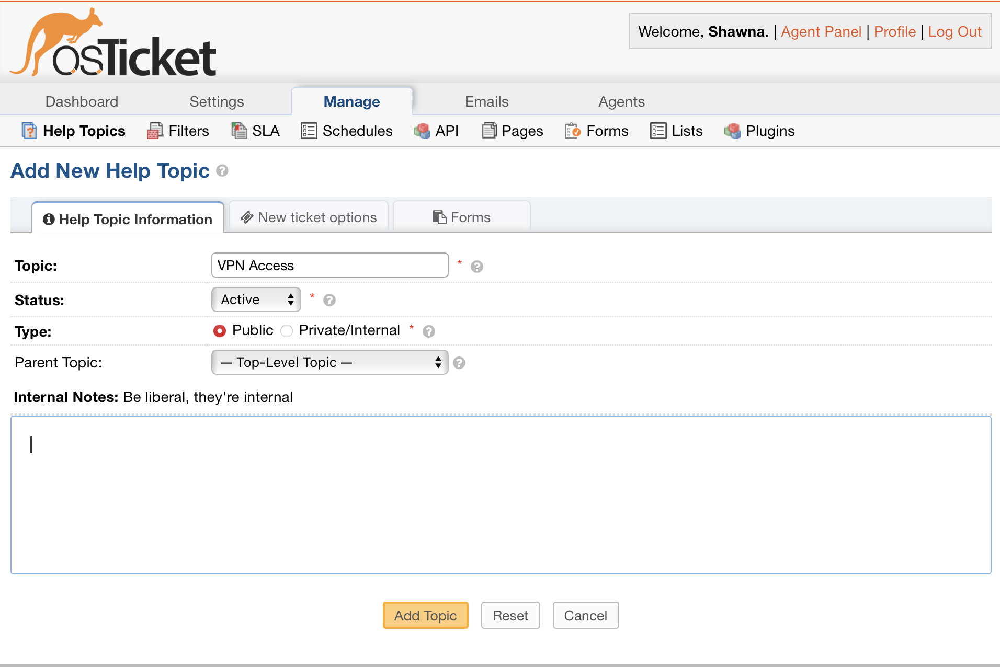
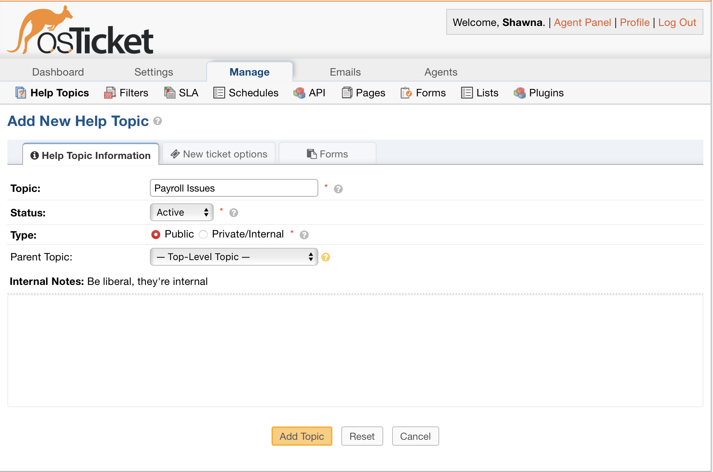

# osTicket-Configuration
This guide provides step-by-step instructions to configure Roles, Agents, Teams, Users, Departments, SLAs, and Help Topics in osTicket. 

## 1. Configuring User Roles

Roles define what regular users (customers, employees, or clients) can do in osTicket.

Steps to Create User Roles

Navigate to Admin Panel > Users > Roles.

Click Add New Role.

Set permissions:

- [x] View Tickets: Allow users to see their own tickets.

- [x] Post Reply: Allow users to respond to their tickets.

- [x] Close Ticket: Allow users to close tickets (optional).
  
   Click __Save Changes__.
  
  

## 2. Creating and Assigning Agents

Agents manage tickets and provide support. Each agent belongs to a Role and Department.

Steps to Add an Agent

Navigate to Admin Panel > Agents > Add New Agent.

- [x] Fill in Name, Email, Username, and Password.

- [x] Assign an Agent Role (e.g., Support Staff, Supervisor, Admin).

- [x] Assign the agent to a Department.

    Click __Save Changes__.
   

## 3. Creating Teams (Collaboration Groups)

Teams allow agents from different departments to work together on specific tickets.

Steps to Create a Team

- [x] Navigate to Admin Panel > Agents > Teams > Add New Team.

- [x] Enter a Team Name.

- [x] Assign multiple agents across departments.

Click __Save Changes__.

## 4. Creating Departments (Ticket Routing)

Departments define who manages specific tickets.

Steps to Create a Department

- [x] Navigate to Admin Panel > Agents > Departments > Add New Department.

- [x] Enter a Department Name (e.g., IT Support, HR Helpdesk).

Click __Save Changes__.

## 6. Creating Help Topics

Help Topics categorize tickets for better organization.

Steps to Create Help Topics

- [x] Navigate to Admin Panel > Manage > Help Topics.

- [x] Click Add New Help Topic.

- [x] Enter a Name (e.g., "Password Reset", "VPN Access").

Click __Save Changes__.

## 7. Configure Service Level Agreements (SLAs)

Navigate to Admin Panel > Manage > SLA Plans.

Create SLA rules like:

1. Critical Issues – Response in 1 hour, Resolution in 4 hours.

2. High Priority – Response in 4 hours, Resolution in 12 hours.

3. Normal Priority – Response in 12 hours, Resolution in 24 hours.
Assign SLAs to __departments__ and __help topics__.

